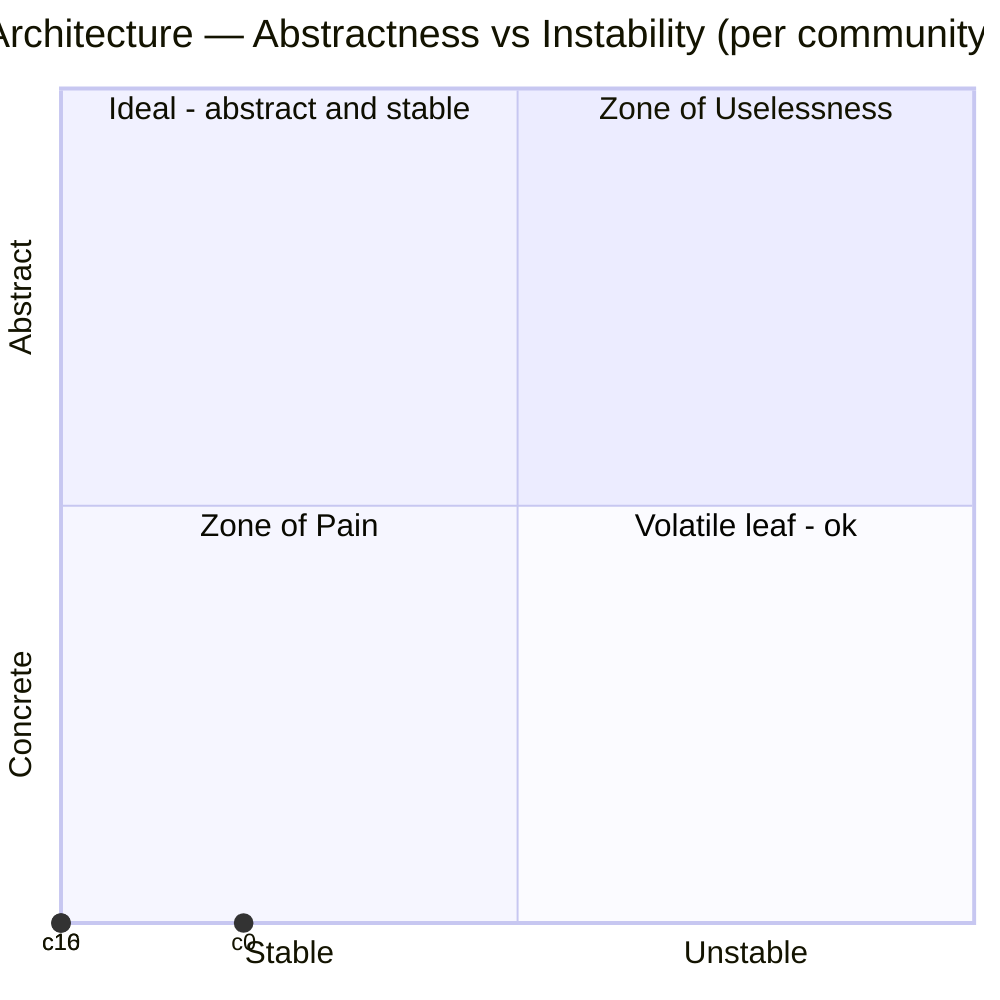

# 📊 Graph Insights — cg-graphify-bridge

> **97% less context** to answer a pinpoint code question · **0** dependency cycles · **100%** of architectural hubs documented

| 🎯 Token efficiency | 🏛️ Architecture | 📚 Documentation |
|:--:|:--:|:--:|
| 97% pinpoint · 96% global | 0 cycles · 3 Zone-of-Pain | hubs 100% · debt 0.4342 |

## 🎯 Token efficiency

Graph-guided retrieval (node identity + neighbourhood) vs reading whole source files:

- **pinpoint** &nbsp; `███████████████████░` 97%
- **global** &nbsp;&nbsp;&nbsp; `███████████████████░` 96%

> GraphRAG reports **26–97% fewer tokens** for graph-guided retrieval ([arXiv:2404.16130](https://arxiv.org/abs/2404.16130)) — this repo lands in-band.
> _Tokenizer: chars/4 estimate (install tiktoken for exact counts); baseline: naive full-file read of the source files a query's nodes live in._

## 🏛️ Architecture

- **Dependency cycles:** 0 — acyclic ✓
- **Zone of Pain:** 3 · **Zone of Uselessness:** 0 communities
- **Leakiest module:** community 19 (conductance 0.5)
- **Top architectural hub (betweenness):** `cg:75637ed541aa7ba9`
- **High fan-out (SRP) candidates:** 4 · **Dead-code review queue:** 2

## 🧹 Technical Debt

**Debt score** &nbsp; `███████░░░░░░░░░░░░░` 35% _(0 = clean → 1 = heavy)_

| Debt type | Count |
|---|--:|
| god-object | 9 |
| dangling-link | 6 |
| high-fan-out | 4 |
| zone-of-pain | 3 |
| dead-code | 2 |

- **Most-indebted feature:** community 0 (3 debt items)
- **Most-indebted component:** `src/cg_graphify_bridge/cli.py` (6 debt items)
- _score contributions: god-object 0.1125, zone-of-pain 0.1, high-fan-out 0.0667, dangling-link 0.0667, dead-code 0.0074_

## 📚 Documenting what matters

- **God-node coverage** &nbsp; `████████████████████` 100%
- **Centrality-weighted coverage** &nbsp; `██████████░░░░░░░░░░` 48% _(the gap vs raw coverage = mis-targeted doc effort)_
- **Darkest subsystem:** community 0 (43% documented)

## ⚠️ Undocumented load-bearing — document these first

Top risk = centrality × (1 − documented)

1. `files` — `src/cg_graphify_bridge/ts_substrate_js/extract.cjs`
2. `_write_json` — `src/cg_graphify_bridge/driver.py`
3. `read_manifest` — `src/cg_graphify_bridge/freshness.py`
4. `_meta` — `src/cg_graphify_bridge/analytics.py`
5. `_ver` — `src/cg_graphify_bridge/engine.py`
6. `_is_test_node` — `src/cg_graphify_bridge/health.py`
7. `process_helper` — `sample/pkg_a/auth.py`
8. `_read_json` — `src/cg_graphify_bridge/freshness.py`
9. `_load_tiktoken` — `src/cg_graphify_bridge/benchmark.py`
10. `_is_test_path` — `src/cg_graphify_bridge/adapter.py`

📖 <b>What each metric measures</b> — plain-language definitions

- **Token efficiency (pinpoint / global)** — the % fewer tokens an agent reads to answer a question using the graph's node summaries instead of opening whole source files — *pinpoint* = single-symbol lookups, *global* = whole-subsystem questions.
- **Dependency cycle** — a set of files that depend on each other in a loop (A→B→…→A); cycles make changes ripple unpredictably — 0 is ideal.
- **Abstractness (A)** — fraction of a community's types that are abstract (interfaces / abstract classes) vs concrete — 0 = all concrete, 1 = all abstract.
- **Instability (I)** — a community's exposure to forced change = outgoing deps ÷ (incoming + outgoing) — 0 = stable (others depend on it), 1 = volatile (it depends on everything).
- **Zone of Pain** — concrete *and* heavily depended-on (low A, low I): rigid and risky to change.
- **Zone of Uselessness** — abstract *but* unused (high A, high I): a dead abstraction to delete or inline.
- **Conductance (leakiest module)** — the share of a community's connections that cross its boundary — high = a leaky module not cleanly separated from the rest.
- **Betweenness (top hub)** — how often a symbol lies on the shortest path between other symbols — a high value is an architectural chokepoint the system routes through.
- **High fan-out** — symbols that depend on an unusually large number of others — a single-responsibility smell / refactor candidate.
- **Dead-code review queue** — symbols nothing else references (excluding entry points, exports, and dynamically-wired symbols — names referenced as values, e.g. argparse `set_defaults(func=…)`, callbacks, `getattr` strings) — a *review* list only; never auto-delete.
- **God-node coverage** — of the most-connected hub symbols, the % that have at least one documentation link.
- **Centrality-weighted coverage** — documentation coverage weighted by each symbol's importance — the gap vs raw coverage reveals whether the docs cover what actually matters.
- **Undocumented hubs** — central hub symbols with no documentation — the doc backlog, ordered by importance.
- **Darkest subsystem** — the community carrying the most architectural importance but the least documentation.
- **Undocumented load-bearing risk** — importance × (1 − documented), ranked — symbols that are both central and undocumented: document these first.
- **Knowledge debt** — a 0–1 roll-up of missing importance-weighted coverage + stale/dangling doc links — lower is better; shown with its components so it's never an opaque score.
- **Debt score** — a 0–1 technical-debt roll-up = weighted, saturating contributions from each debt type (cycles, Zone-of-Pain, god-objects, high-fan-out, dead-code, dangling links), shown per-type so it's never opaque — higher = more debt. Also broken down by feature (community) and component (file).
- **God object** — a symbol with unusually high betweenness (an architectural chokepoint) — central enough that changing it ripples widely; a split candidate.
- **Dangling link** — a doc→code link whose target symbol no longer exists in the graph — a broken reference / documentation debt to fix or re-point.

---

_Generated by [cg-graphify-bridge](https://github.com/evannordinpro/cg-graphify-bridge) from the committed knowledge graph (`graphify-out/`). Health metrics are production-scoped; see `docs/setup.md` → Health & benchmarks. Versioned per build via CI (content-deterministic)._
